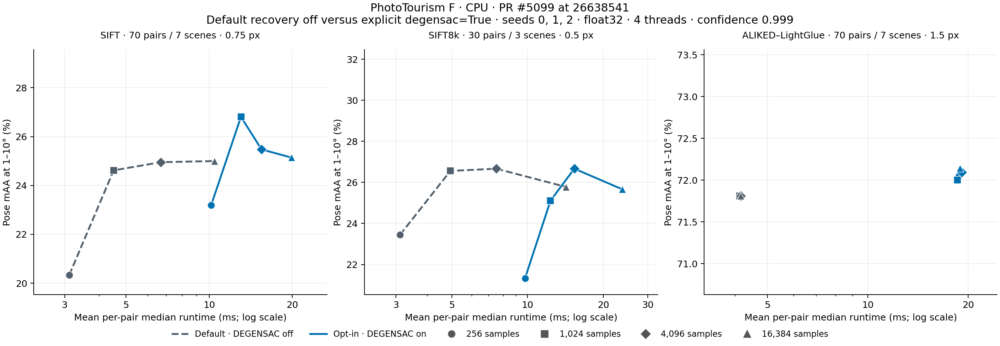
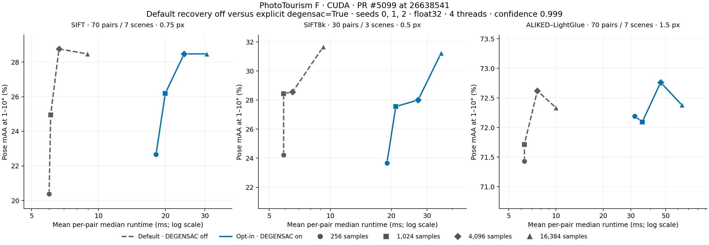

# PR #5099: final default-off versus opt-in curves

Measured implementation: [`26638541`](https://github.com/kornia/kornia/commit/26638541), Kornia 0.9.0rc1. Both curves use this commit. Omitting the `degensac` argument is compared with explicit `degensac=True`; the constructor defaults to `False`. No runtime compilation or exploratory numerical kernels are enabled.

## Method

- Public `RANSAC("fundamental")`, default sampling/scoring/local optimization, original correspondence order, no PROSAC, confidence 0.999, float32 inputs preloaded on the measured device.
- 170 cached feature/pair records: 70 SIFT and 70 ALIKED–LightGlue across 7 scenes, 30 SIFT8k across 3 scenes. Fixed pixel thresholds: SIFT 0.75, SIFT8k 0.5, ALIKED–LightGlue 1.5.
- Budgets 256, 1024, 4096, 16384; quality seeds 0, 1, 2. Pose mAA uses strict 1–10° thresholds and equal scene/seed weighting. This is a fixed-threshold subset evaluation, not a complete dataset or threshold envelope.
- Repository `common.warm_up_cpu`, `common.time_us_or_error` (minimum 0.1 s, repeated median/IQR, seed 0), and `common.save_json`. Curve latency is the mean of the per-pair medians; RANSAC's internal host/device work is included. CUDA is synchronized by the timer.
- Serial runs: CPU default, CPU opt-in, CUDA opt-in, CUDA default. Four PyTorch/OpenCV threads; TF32 matmul disabled. RTX 4090, PyTorch 2.14.0+cu130, Python 3.11.14. Every process asserted/printed its imported checkout and explicit interpreter before measuring.
- All 8,160 quality evaluations completed without errors. Every default evaluation also checked exact F/mask equality with explicit `degensac=False` (4,080 comparisons). At budget 4096, all 1,020 opt-in outputs match the previous production commit 9ad021c8 bitwise.

All 8,160 output hashes also match the immediate `cde4280b` baseline before sample-origin tracking was made conditional. [Full comparison](origin-comparison.json).

## Budget 4,096

| Device | Features | Default mAA | Opt-in mAA | Change (pp) | Default ms | Opt-in ms |
|---|---|---:|---:|---:|---:|---:|
| CPU | sift | 24.95% | 25.48% | +0.52 | 6.68 | 15.47 |
| CPU | sift8k | 26.67% | 26.67% | +0.00 | 7.51 | 15.33 |
| CPU | aliked_lightglue | 71.81% | 72.10% | +0.29 | 4.16 | 19.10 |
| CUDA | sift | 28.76% | 28.48% | -0.29 | 6.65 | 24.24 |
| CUDA | sift8k | 28.56% | 28.00% | -0.56 | 6.52 | 27.11 |
| CUDA | aliked_lightglue | 72.62% | 72.76% | +0.14 | 7.61 | 46.45 |

## Data

[All curve values as CSV](comparison.csv). Vector plots: [CPU PDF](phototourism-cpu.pdf), [CUDA PDF](phototourism-cuda.pdf).

Raw results include per-pair/seed quality, output hashes, repeated timing medians/IQRs, and run metadata:

- [CPU default](default-cpu.json.gz)
- [CPU opt-in](on-cpu.json.gz)
- [CUDA default](default-cuda.json.gz)
- [CUDA opt-in](on-cuda.json.gz)

Dataset SHA-256: `2c9cf5472239646a34ccd051a9d7e846482bb2f79d6e0baf63e292f7f8d453e8`.
Measurement harness SHA-256: `c43d66820a050bcaff9f4c7ab796588781bb16e296fee670e8d02d90b7dfd2e4`.

The original implementation was developed with Claude (Opus 5.5); Codex performed the subsequent review fixes, optimization and benchmark refresh.

Written by Codex (gpt-6) on behalf of @ducha-aiki
