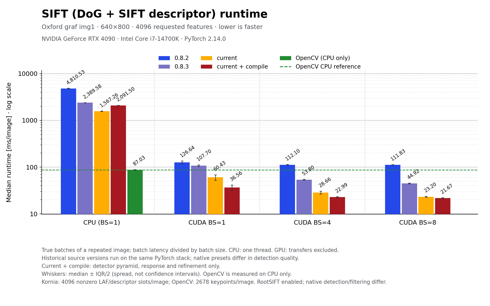

# SIFT runtime across releases and batch sizes

Measured 2026-09-05 on an RTX 4090 and Intel Core i7-14700K, WSL2 Linux,
Python 3.11.14, PyTorch 2.14.0+cu130, OpenCV 4.11.0. CPU and OpenCV use one thread.
All historical Kornia sources run on this **same current dependency stack**, not
their original release environments.



[Vector SVG](sift_runtime.svg) · [Raw JSON measurements](sift_runtime_results/)

## Results

Median runtime in **milliseconds per image**, lower is faster. CUDA batch timings
are divided by batch size. Each cell is median ± IQR; chart whiskers show ± IQR/2
as a spread indicator, not a confidence interval.

| Version/backend | CPU, BS=1 | CUDA, BS=1 | CUDA, BS=4 | CUDA, BS=8 |
| --- | ---: | ---: | ---: | ---: |
| 0.8.2 | 4810.53 ± 139.17 | 126.64 ± 16.35 | 112.10 ± 3.72 | 111.83 ± 1.64 |
| 0.8.3 | 2389.58 ± 20.53 | 107.70 ± 9.46 | 53.80 ± 2.26 | 44.92 ± 1.55 |
| Current | 1567.26 ± 25.61 | 60.43 ± 16.58 | 28.66 ± 4.20 | 23.20 ± 1.26 |
| Current + compile | 2091.50 ± 27.13 | 36.56 ± 9.63 | 22.99 ± 0.53 | 21.67 ± 1.08 |
| OpenCV, CPU only | 87.03 ± 3.45 | — | — | — |

Batching matters: current eager runtime per image falls by 2.60× from CUDA batch
one to batch eight; compiled runtime falls by 1.69×. Compilation's additional gain
shrinks as batch size grows: approximately 1.65×, 1.25×, and 1.07× at batches one,
four, and eight. The small batch-eight difference deserves caution given timing
spread. The older 0.8.2 implementation barely benefits from batching here.

Compilation is **1.33× slower on CPU** for this preset and machine. The chart keeps
that regression. These observations establish the measured batching relationship,
not the cause of the CPU compiler regression; a causal attribution would need
component-level ablations.

OpenCV is a CPU reference line across the CUDA categories, not an OpenCV CUDA
measurement. Its native detector returns **2,678 keypoints**, while all Kornia
runs return **4,096 nonzero LAF/descriptor slots**, despite the same requested cap.
Historical nonzero slots are not necessarily valid detections: older versions
could retain LAFs whose response had been rejected. This comparison exposes the
native workloads; it does not assert equal detection quality or descriptor work.

## Workload and provenance

- One original Oxford graf `img1.ppm`, 640×800, repeated into a contiguous tensor
  batch of one, four, or eight. It is a **true batch**, not a loop over GPU images.
  Repetition controls image content while isolating the effect of batch size.
- Public `SIFTFeatureScaleSpace(num_features=4096, upright=False, rootsift=True)`
  from each source revision. Each native preset retains its detector/refiner,
  including changes introduced between releases. Common settings include three
  pyramid levels plus three extra levels, sigma 1.6, doubled image, minimum octave
  size 32, measurement-region factor 6, 19-pixel orientation patches, and 41-pixel
  RootSIFT descriptor patches. No settings were reduced to make a faster bar.
- The chart differs from the earlier [graf pair benchmark](graf_benchmark.md): it
  uses the public preset's `ConvQuadInterp3d`, not `AdaptiveQuadInterp3d` with
  32-pixel descriptor patches, and times extraction only rather than two extractions
  plus matching. Do not compare the absolute timings between those two workloads.
- Current compilation uses `compile_modules=["scale_pyr", "resp", "subpix"]`,
  `dynamic=True`, default Inductor mode. Orientation, patch description, and the
  surrounding pipeline remain eager. No autocast; matmul TF32 is disabled, with
  cuDNN defaults recorded in JSON.
- OpenCV uses `SIFT_create(nfeatures=4096, nOctaveLayers=3, contrastThreshold=0.04,
  edgeThreshold=10, sigma=1.6)`, `detectAndCompute`, then NumPy RootSIFT normalization.
  Its native contrast/edge filtering differs from Kornia. OpenCV receives resident
  grayscale uint8 input; Kornia receives resident grayscale float32 input in [0,1].
- Timed region: extraction only, excluding input preparation/transfer, compilation,
  matching, and RANSAC. `common.time_us` supplies warmed repeated, CUDA-synchronized
  median/IQR timings; the budget is at least five warm-call durations for slow CPU runs.
- All 17 configurations completed successfully, in sequential independent processes.
  Every run prints the explicit interpreter and asserts the expected imported
  checkout, preventing editable-install mistakes. Source hashes, input SHA-256,
  complete model representations, output counts, and memory are in the raw JSON.

| Label | Source revision |
| --- | --- |
| 0.8.2 | `v0.8.2`, `856fd1ae` |
| 0.8.3 | `v0.8.3`, `d6bb4bf0` |
| Current / current + compile | `0dbcad81`, the optimization branch |
| OpenCV | 4.11.0; harness revision `15d548fb` |

Each compiled configuration used a fresh Inductor cache. First calls, including
compilation and initialization, took 78.23 s on CPU and 44.82/55.83/57.72 s on CUDA
at batch sizes one/four/eight. These are excluded from the plotted steady-state
times, and are not pure compiler-time measurements.

At CUDA batch eight, peak extra allocated tensor memory is approximately 14,610 MiB
for 0.8.2, 4,487 MiB for 0.8.3, 5,171 MiB for current eager, and 5,510 MiB for current
compiled. This is above resident inputs/models, not allocator-reserved memory.

## Reproduction

Use the [graf dataset and archive hash](graf_benchmark.md#reproduction). Run one
configuration per process; select CPU batch one and CUDA batches one, four, eight:

```bash
.venv/bin/python -m benchmarks.feature.sift_runtime \
  --image /data/graf/img1.ppm --expected-checkout "$PWD" \
  --device cuda --batch 8 --series current --json current-cuda-8.json
.venv/bin/python -m benchmarks.feature.sift_runtime \
  --image /data/graf/img1.ppm --expected-checkout "$PWD" \
  --device cuda --batch 8 --series 'current + compile' --json compiled-cuda-8.json
.venv/bin/python -m benchmarks.feature.sift_runtime \
  --image /data/graf/img1.ppm --expected-checkout "$PWD" \
  --device cpu --batch 1 --series OpenCV --json opencv-cpu-1.json
```

For historical revisions, create detached worktrees and invoke the shared harness
from stdin in each worktree root. Substitute your primary checkout's absolute path:

```bash
git worktree add --detach /tmp/kornia-sift-0.8.2 v0.8.2
cd /tmp/kornia-sift-0.8.2
/absolute/primary/.venv/bin/python - \
  --image /data/graf/img1.ppm --expected-checkout "$PWD" \
  --device cuda --batch 8 --series 0.8.2 --json /tmp/0.8.2-cuda-8.json <<'PY'
import runpy
runpy.run_path('/absolute/primary/benchmarks/feature/sift_runtime.py', run_name='__main__')
PY
```

Repeat for tag `v0.8.3` and the other device/batch combinations. Re-render the
committed measurements from the primary checkout:

```bash
.venv/bin/python -m benchmarks.feature.plot_sift_runtime \
  --inputs benchmarks/feature/sift_runtime_results/*.json \
  --output benchmarks/feature/sift_runtime --cpu-label 'Intel Core i7-14700K'
```

The renderer checks shapes, feature budget, source-input hash, Python/PyTorch,
thread settings, and GPU metadata before combining results. Missing measurements
are marked explicitly rather than plotted as zero. Matplotlib is optional.
