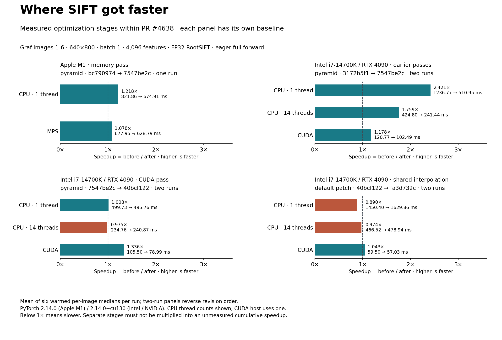
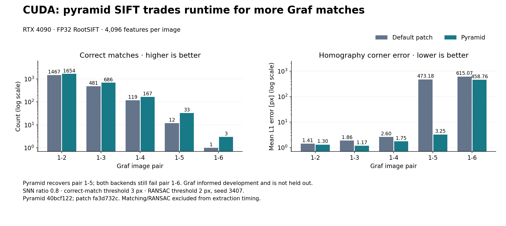

# SIFT: device speedups and matching quality

PR #4638 adds `SIFTFeatureScaleSpace(descriptor_backend="pyramid")`: one Gaussian
pyramid shared by detection, orientation and RootSIFT description. The default remains
`descriptor_backend="patch"`. The new detector ranks strict DoG extrema by absolute
response and takes top-K, without contrast or edge rejection; the two backends therefore
have different matching quality even at the same requested feature count.

## What got faster, on which device?



Every row below is a measured comparison **within this PR**, not a comparison with main
or a released Kornia version. Ratios are before / after; below 1× means slower. Separate
measurement sessions have different baselines: do not multiply the stage ratios into a
claimed cumulative speedup. These figures summarize existing measurements, not a new run
on the merged PR head.

| Backend / optimization stage | Hardware / execution | Before → after (ms/image) | Speedup | Library revisions |
| --- | --- | ---: | ---: | --- |
| Pyramid / initial pass | Apple M1 CPU, 1 thread | 1201.12 → 794.80 | 1.51× | `3172b5f1` → `bc790974` |
| Pyramid / initial pass | Apple M1 MPS | 622.61 → 587.22 | 1.06× | `3172b5f1` → `bc790974` |
| Pyramid / memory pass | Apple M1 CPU, 1 thread | 821.86 → 674.91 | 1.22× | `bc790974` → `7547be2c` |
| Pyramid / memory pass | Apple M1 MPS | 677.95 → 628.79 | 1.08× | `bc790974` → `7547be2c` |
| Pyramid / initial + memory passes | Intel i7-14700K CPU, 1 thread | 1236.77 → 510.95 | 2.42× | `3172b5f1` → `7547be2c` |
| Pyramid / initial + memory passes | Intel i7-14700K CPU, 14 threads | 424.80 → 241.44 | 1.76× | `3172b5f1` → `7547be2c` |
| Pyramid / initial + memory passes | NVIDIA RTX 4090 CUDA | 120.77 → 102.49 | 1.18× | `3172b5f1` → `7547be2c` |
| Pyramid / CUDA pass | Intel i7-14700K CPU, 1 thread | 499.73 → 495.76 | 1.01× | `7547be2c` → `40bcf122` |
| Pyramid / CUDA pass | Intel i7-14700K CPU, 14 threads | 234.76 → 240.87 | 0.97× | `7547be2c` → `40bcf122` |
| Pyramid / CUDA pass | NVIDIA RTX 4090 CUDA | 105.50 → 78.99 | 1.34× | `7547be2c` → `40bcf122` |
| Default patch / shared interpolation | Intel i7-14700K CPU, 1 thread | 1450.40 → 1629.86 | 0.890× | `40bcf122` → `fa3d732c` |
| Default patch / shared interpolation | Intel i7-14700K CPU, 14 threads | 466.52 → 478.94 | 0.974× | `40bcf122` → `fa3d732c` |
| Default patch / shared interpolation | NVIDIA RTX 4090 CUDA | 59.50 → 57.03 | 1.043× | `40bcf122` → `fa3d732c` |

The CPU improvements come from specialized Gaussian filtering, bounded sparse
neighbour/refinement buffers, smaller descriptor chunks and fewer copies. MPS benefits
from atlas layout and separable pooling. CUDA benefits from packed finite differences,
Cramer solves and separable descriptor pooling. Sharing the interpolation optimization
also gives default patch SIFT a modest CUDA gain. CPU arithmetic is unchanged in that
last pass; the separate-process losses above are retained, and no CPU gain is claimed.

Additional measured regimes:

- CUDA pyramid, full-resolution batch two: **140.19 → 97.41 ms/batch (1.44×)** for the
  CUDA pass. This is one run per revision, not the repeated batch-one matrix.
- Apple M1 memory pass: Graf peak live CPU tensor allocation **198.60 → 158.68 MiB
  (20.1% less)**; checkerboard **347.97 → 95.62 MiB (72.5% less)**.
- CUDA pyramid peak extra tensor allocation stays about **238 MiB**. Default patch
  SIFT in the shared-interpolation comparison uses about **650 MiB**; these are separate
  forwards with the allocation scopes documented in their reports, not total device RAM.
- Native FP16/BF16 CPU/CUDA forwards are covered, but **no half-precision speedup is
  established**. No end-to-end compiled, held-out-quality or larger-batch claim is made.

## Runtime versus quality

Default patch SIFT is still faster on CUDA: its latest measurement is **57.03 ms/image**,
versus **78.99 ms/image** for pyramid SIFT, from separate sessions. The earlier direct
backend comparison also favored patch (62.08 versus 102.49 ms before the CUDA pass).
Pyramid SIFT finds more correct Graf matches and recovers pair 1–5; **both fail pair 1–6**.



The chart uses the latest recorded patch and pyramid quality rows. All matching/RANSAC
rows are unchanged by the CUDA and shared-interpolation passes. The first Apple CPU pass
changed correct-match counts by at most one per pair, with corner errors improving on
some pairs and worsening on others. Graf informed development and is not held out.

## Protocol and reproducibility

Oxford Graf images 1–6, 640×800 grayscale, batch one unless stated, FP32 RootSIFT,
4,096 returned features per image, eager inference. Entire public forward is timed,
including pyramid construction and allocations; loading, transfers, matching, RANSAC
and profiling are excluded. Timings are means of six warmed per-image medians. Intel/CUDA
uses two runs in reversed revision order; each Apple comparison uses one run per revision.
Per-image IQRs are in the detailed reports; they describe spread, not confidence intervals.

Apple: M1, macOS 26.5.1, Python 3.11.14, PyTorch 2.14.0, CPU one thread, synchronized MPS.
Intel/NVIDIA: i7-14700K / RTX 4090, WSL2, Python 3.11.14, PyTorch 2.14.0+cu130,
CUDA 13.0, CPU 1/14 threads as labeled, CUDA host one thread, TF32 disabled.
Matching: SNN ratio 0.8, correct-match threshold 3 px. RANSAC: 2 px threshold,
seed 3407; corner error is mean L1 discrepancy against ground truth.

The **109 raw benchmark JSONs are removed from the PR diff**. Their original contents,
including source/input hashes and IQRs, remain accessible at immutable archive commit
[`efb04dbf`](https://github.com/kornia/kornia/tree/efb04dbf9c85e4cf71625cc2467bd5243b0c803c/benchmarks).
All detailed reports link to that archive. Keep local reruns outside the source tree.

Regenerate both figures directly from archived Git objects, without restoring JSON files:

```bash
# If the archive commit is absent from a shallow clone:
git fetch origin efb04dbf9c85e4cf71625cc2467bd5243b0c803c
# Use the Pixi-selected project environment (with matplotlib installed):
python benchmarks/feature/plot_sift_summary.py
```

Detailed methodology, controls, regressions and reproduction commands:
[initial Apple pass](sift_scale_space.md), [Apple memory pass](sift_memory.md),
[Intel/CUDA pyramid](sift_devices.md), [shared interpolation](../geometry/quad_interp.md),
[native half precision](../geometry/quad_interp_half.md).
The [generic pyramid descriptor experiment](dense_sift.md) is a separate historical API
comparison and is excluded from these specialized-pipeline speedups.
