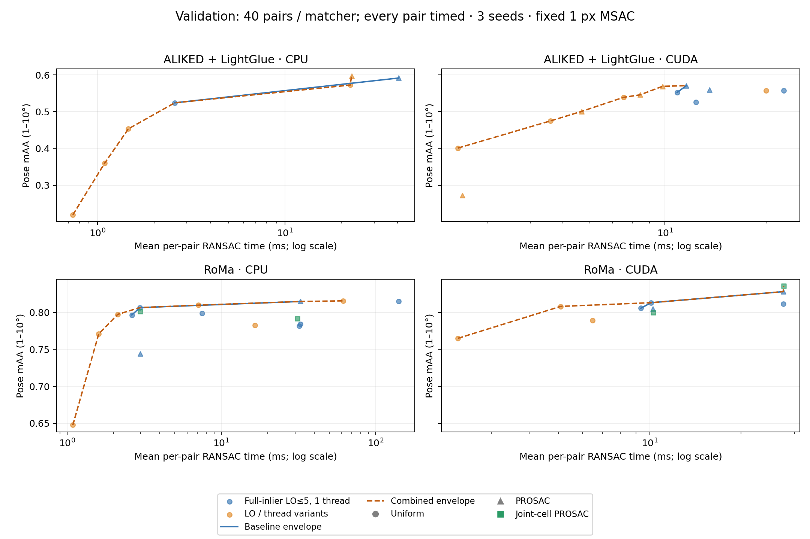
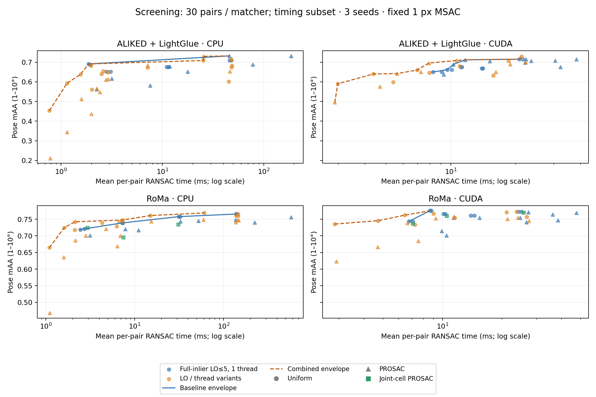

# RANSAC time–mAA frontiers for learned matchers

This follows the [learned-matcher stopping experiment](prosac_learned.md).
The objective is the nondominated wall-clock / pose-mAA curve separately for
CPU/CUDA and ALIKED + LightGlue/RoMa. Sample count alone is not a speed metric.
The near-vertical GPU curve in the [homography benchmark](https://github.com/danini/homography-benchmark/blob/main/assets/heb_benchmark_traditional.png)
motivates sweeping larger CUDA batches; the measurements below evaluate
fundamental-matrix pose accuracy on learned correspondences.

## Findings and proposals

The measured frontier improves through **joint batch, sampler, refinement and
thread choices**. PROSAC is useful at some operating points; it is neither an
accuracy-only switch nor an automatic speedup. The current production runtime
is unchanged from merged #4902, and the premature prefix-stopping patch is withdrawn.

- **RoMa, faster CPU regime:** batch-32 uniform sampling with bounded 32-point
  refits gives **0.7975 mAA / 2.13 ms**, versus **0.7967 / 2.63 ms** for full-inlier
  refinement at the same batch and budget. Batch-32 uniform with maximum 256 draws
  remains a higher-accuracy point at **0.8067 / 2.97 ms**. Keep both trade-offs.
- **RoMa, faster CUDA regime:** batch-256 uniform with one full-inlier refinement
  gives **0.8083 / 5.09 ms**, versus **0.8058 / 9.34 ms** with up to five refinements.
  More refinement does not automatically improve pose accuracy.
- **RoMa, CUDA accuracy end:** at batch/budget 8192, joint-cell PROSAC gives
  **0.8358 / 27.61 ms**, ordinary PROSAC **0.8283 / 27.54 ms**, and uniform
  **0.8117 / 27.57 ms**. The same-budget controls establish that the observed
  difference is not just extra draws. However, the grid variant was dominated
  on screening by a smaller uniform configuration and did not improve the CPU
  or small-batch CUDA frontier. Treat this as an **experimental option for the
  accuracy end**, not a general dense-matcher default; the 0.0075 advantage over
  ordinary PROSAC on validation needs a larger, untouched evaluation set.
- **ALIKED + LightGlue, CUDA:** batch-2048 PROSAC with bounded 32-point refits gives
  **0.5692 / 9.83 ms**, versus **0.5600 / 13.52 ms** with full-inlier refinement.
  Batch-1024 PROSAC with full-inlier refinement remains the observed accuracy
  endpoint at **0.5708 / 11.56 ms**. The slight mAA difference is not evidence
  of statistically established superiority.
- **ALIKED + LightGlue, CPU:** four-thread batch-2048 PROSAC gives
  **0.5975 / 22.74 ms**, versus **0.5917 / 40.53 ms** with one thread. Small-batch
  uniform configurations cover the faster end. Threading can change floating-point
  results as well as time; the small accuracy difference is not a claimed benefit
  of threading itself.

First, retain these existing-API choices as candidate points along separate
matcher/device curves. RoMa supplies exactly 2,048 correspondences per pair;
ALIKED + LightGlue supplies 213–1,304, median 577 (the `n2048` cache name describes
the detector budget). Cross-matcher timing differences therefore reflect both
match geometry and point count. Within-matcher comparisons preserve identical
correspondences; a future automatic policy should account for point count explicitly
and validate any assumption about spatial correlation or confidence calibration.
Second, retain joint-cell ranking as an explicitly named experimental preprocessor
for large CUDA budgets, including its cost; do not silently replace ordinary
confidence ordering or reintroduce prefix confidence stopping.
Third, test larger nonminimal initial samples and degeneracy-aware estimation
as described below. Those are proposals, not implementations or measured gains
in this report. Validate on a larger untouched set before changing global defaults.

The study contains **212 configurations and 20,460 predictions across 92 runs**:
166 screening configurations and 46 validation/control configurations. There
were no estimator exceptions. Per-scene quality cells and pose failures remain
in the data; the curves are empirical envelopes, not statistical guarantees.

## Fixed semantics and experimental axes

All runs use merged #4902 (`dfac11ab`), fundamental eight-point estimation,
MSAC with a **1-pixel threshold**, confidence **0.999**, and seeds **0/1/2**.
The nominal threshold and scoring definition are fixed across devices and matchers.
The baseline retains its CPU/CUDA numerical differences (including the Sampson
denominator epsilon, documented in [#4881](https://github.com/kornia/kornia/issues/4881));
this experiment does not alter those implementations. A post-hoc audit of the
returned CPU batch-32 control models changes fewer than 0.002% of mask decisions
on average when that epsilon is removed; it does not bound effects on intermediate
hypothesis ranking. Numerical consistency remains separate follow-up work.
PROSAC uses its full configured draw budget. Uniform stopping is checked between
batches: a CUDA batch of 2,048 evaluates at least 2,048 sample sets. The earlier
46–47 mean was from CPU batches of 32, not CUDA batches of 2,048. The rejected prefix-stopping patch
is not used; it remains reproducible at `cbf98d55` but is withdrawn from the branch.

The initial sweep varies batches and draw budgets: CPU batches 32/128/512/2048,
CUDA 256/1024/2048/4096/8192. Expansion varies local optimization (0/1/5 maximum iterations,
full inlier fits versus existing `lo_sample_size=32`), CPU thread count (1/4),
and joint-cell confidence ordering for RoMa. These are algorithm/execution
choices, not changes to the geometric acceptance criterion. These are configuration
and ordering comparisons on the same runtime, not claims of a new solver or
kernel speedup. The baseline envelope specifically uses full-inlier LO≤5 and
one CPU thread; the combined envelope also admits the other tested policies.

There are ten identical image pairs per scene per matcher, using the corrected
RoMa scores described in the previous report. Screening uses sacre_coeur,
reichstag and st_peters_square. Validation uses british_museum,
florence_cathedral_side, lincoln_memorial_statue and london_bridge. Configuration
selection was frozen from screening: the union of the original and expanded
frontiers, plus the fastest and highest-mAA grid-ordering controls per device
(40 configurations). After the high-budget grid result appeared on validation,
six same-budget standard-sampler controls were added to isolate ordering from
budget. Both selections are preserved, and the added controls are marked in
the JSON; the final plots include all 46 configurations. These attribution checks
are not additional blind validation.
These four validation scenes appeared in the earlier stopping experiment, so
this is **not an untouched holdout**. The validation envelope is among the
selected configurations; screening-dominated configurations could generalize
differently. These results support proposals, not universal defaults.

## Timing and reproducibility

Hardware: i7-14700K / RTX 4090 under WSL2; Python 3.11.14, PyTorch 2.14.0+cu130.
All timing uses `benchmarks/common.py::time_us`, CPU warmup, pinned estimator
seeds and accelerator synchronization. Heavy jobs run sequentially.
Screening times two pairs per scene/matcher/seed, minimum 0.05 seconds per timer.
Validation times **every pair and seed**, using `time_us` on blocks containing
three full estimator calls (minimum 0.05 seconds). Block medians and IQRs are
divided by three, then per-pair/seed medians are averaged. Thus even a slow
configuration executes at least three calls in a timed block. These repeats
are not independent statistical trials; WSL2 scheduling and temporal drift
remain limitations. Initial separate-timer validation runs were superseded and
are excluded from all reported validation results.
Pose mAA averages accuracy at 1–10 degrees, with equal scene/seed weighting.
Failures remain in all quality aggregates.

Inputs are already on the selected device and sorted by match confidence.
Feature extraction, loading, host-to-device transfer and initial confidence
sorting are outside the timed region. For the proposed grid ordering, its
construction, point gathers and inverse mask permutation are **inside** timing.
Every model is scored against the full, unchanged correspondence set.

`prosac_pareto.json` retains configuration/cell aggregates, source hashes,
raw-result hashes, the frozen validation selection, and exact experiment scripts.
`prosac_pareto_pairs.json.gz` contains the per-pair timings, pose errors and
diagnostics, linked by configuration ID and verified by SHA-256. Raw predictions remain in
`/tmp/prosac-wallclock` and `/tmp/prosac-validation`. Scripts record their local
paths; relocate these explicitly when reproducing. Run the benchmark interpreter
from the baseline checkout, and check the printed Kornia source path. Do not run
an external script against an editable installation and assume changing the
working directory alone selects another revision.

## Dense-match diagnosis

RoMa already performs inverse-density balanced sampling in joint correspondence
space ([reference implementation](https://github.com/Parskatt/RoMa/blob/77f8d68803526dcddfd9b7a46bc76125bdc25f15/romatch/models/matcher.py)).
Confidence sorting can concentrate its early prefixes again. Across the 70 pairs,
the first eight RoMa matches occupy a median of 3/16 cells per image; the proposed
ordering raises this to 6/16. ALIKED also has concentrated prefixes (3/16), so
spatial concentration is not unique to dense matching or proof of the sole cause.

Against the calibrated ground-truth fundamental matrix, using a one-pixel
textbook Sampson criterion, RoMa's top 128 confidence matches are 98.9% consistent
with epipolar geometry versus 91.1% overall; ALIKED's are 97.3% versus 86.4%.
These are means of per-pair fractions, not pooled correspondence fractions or
verified true correspondences. The diagnostic uses denominator epsilon 1e-20
for the arbitrarily scaled ground-truth matrix, rather than Kornia CPU's 1e-8.
The corrected scores carry useful information, but prefix inlier confidence
alone does not certify pose accuracy; these observations do not isolate the cause.

The proposed ordering normalizes each coordinate in `(x1,y1,x2,y2)` by the
observed per-pair correspondence bounds, then divides it into four bins. It takes the best-confidence correspondence from every occupied
joint cell before any cell's second correspondence, retaining confidence order
within each layer. It retains every input match. This encourages **joint-cell
diversity**, not guaranteed distinct image cells or nonplanar structure. It also
lowers RoMa's top-128 ground-truth inlier rate to 93.8%, so coverage has a real
purity trade-off. CPU/CUDA permutation, zero-extent and public-RANSAC mask
restoration checks cover the prototype.

## Further algorithmic proposals

- Bounded randomized refits use Kornia's existing public `lo_sample_size` API.
  Bounded mode uses randomized refits followed by a full-inlier refit.
  The general motivation is similar to [LO+](https://www.bmva-archive.org.uk/bmvc/2012/BMVC/paper095/paper095.pdf),
  but this experiment does not implement that paper's complete algorithm.
- For dense matches, separately test nonminimal **initial** samples of 12/16
  points. This needs a proper API, with draw size separated from the minimum
  support required by the model and the actual draw size used in uniform
  stopping probabilities. It has not been evaluated here; mutating
  `minimal_sample_size` in a benchmark would obscure those semantics.
- Diagnose planar/poorly conditioned initial samples before adding a geometric
  rejection policy. Image coverage alone cannot distinguish a broad plane from
  useful parallax. A DEGENSAC-style comparison is a concrete next experiment
  ([Chum, Werner and Matas, CVPR 2005](https://cmp.felk.cvut.cz/~werner/papers/chum-degen-cvpr05.pdf));
  dominant-planarity has not been established as the cause in these pairs. Any
  filter needs its own time–mAA curve and failure accounting.

## Validation frontiers

The table includes the combined empirical frontier and any superseded baseline-frontier points.
These are observed envelopes, not statistically established dominance. Asterisks identify post-hoc
controls appearing in the table; six same-budget ordering controls were evaluated overall.

### CPU / ALIKED + LightGlue

| Sampler | Batch / max draws | LO max / subset cap | Threads | ms | mAA | Envelope |
|---|---:|---:|---:|---:|---:|---|
| Uniform | 32 / 32 | 0 / full | 1 | 0.74 | 0.2192 | Combined |
| Uniform | 32 / 32 | 1 / full | 1 | 1.09 | 0.3600 | Combined |
| Uniform | 32 / 32 | 5 / 32 | 1 | 1.46 | 0.4533 | Combined |
| Uniform | 32 / 256 | 5 / full | 1 | 2.58 | 0.5242 | Combined |
| Uniform | 2048 / 2048 | 5 / full | 4 | 22.33 | 0.5725 | Combined |
| PROSAC | 2048 / 2048 | 5 / full | 4 | 22.74 | 0.5975 | Combined |
| PROSAC | 2048 / 2048 | 5 / full | 1 | 40.53 | 0.5917 | Baseline only |

### CPU / RoMa

| Sampler | Batch / max draws | LO max / subset cap | Threads | ms | mAA | Envelope |
|---|---:|---:|---:|---:|---:|---|
| Uniform | 32 / 32 | 0 / full | 1 | 1.09 | 0.6475 | Combined |
| Uniform | 32 / 32 | 1 / full | 1 | 1.60 | 0.7708 | Combined |
| Uniform | 32 / 32 | 5 / 32 | 1 | 2.13 | 0.7975 | Combined |
| Uniform | 32 / 32 | 5 / full | 1 | 2.63 | 0.7967 | Baseline only |
| Uniform | 32 / 256 | 5 / full | 1 | 2.97 | 0.8067 | Combined |
| Uniform | 128 / 128 | 5 / 32 | 1 | 7.09 | 0.8100 | Combined |
| PROSAC* | 512 / 512 | 5 / full | 1 | 32.56 | 0.8150 | Combined |
| Uniform | 2048 / 2048 | 5 / full | 4 | 61.65 | 0.8158 | Combined |

### CUDA / ALIKED + LightGlue

| Sampler | Batch / max draws | LO max / subset cap | Threads | ms | mAA | Envelope |
|---|---:|---:|---:|---:|---:|---|
| Uniform | 256 / 256 | 0 / full | 1 | 2.45 | 0.4008 | Combined |
| Uniform | 256 / 256 | 1 / full | 1 | 4.59 | 0.4750 | Combined |
| PROSAC | 2048 / 2048 | 0 / full | 1 | 5.67 | 0.5008 | Combined |
| Uniform | 256 / 256 | 5 / 32 | 1 | 7.55 | 0.5392 | Combined |
| PROSAC | 2048 / 2048 | 1 / full | 1 | 8.43 | 0.5458 | Combined |
| PROSAC | 2048 / 2048 | 5 / 32 | 1 | 9.83 | 0.5692 | Combined |
| Uniform | 1024 / 4096 | 5 / full | 1 | 10.86 | 0.5525 | Baseline only |
| PROSAC | 1024 / 1024 | 5 / full | 1 | 11.56 | 0.5708 | Combined |

### CUDA / RoMa

| Sampler | Batch / max draws | LO max / subset cap | Threads | ms | mAA | Envelope |
|---|---:|---:|---:|---:|---:|---|
| Uniform | 256 / 256 | 0 / full | 1 | 2.33 | 0.7650 | Combined |
| Uniform | 256 / 256 | 1 / full | 1 | 5.09 | 0.8083 | Combined |
| Uniform | 256 / 256 | 5 / full | 1 | 9.34 | 0.8058 | Baseline only |
| Uniform | 1024 / 4096 | 5 / full | 1 | 10.10 | 0.8133 | Combined |
| PROSAC* | 8192 / 8192 | 5 / full | 1 | 27.54 | 0.8283 | Combined |
| Grid PROSAC | 8192 / 8192 | 5 / full | 1 | 27.61 | 0.8358 | Combined |

## Screening curves

Screening and validation contain different scenes and timing regimes; compare policies within
each plot. Do not join points across the two sets. All screening configurations, including
dominated ones, remain in the JSON.

## Verification

The data audit checked all 92 runs against the dataset and baseline source hashes,
fixed estimator settings, whole-batch accounting and absence of estimator exceptions.
All 212 aggregate mAA/time records were reconstructed from the compressed per-pair
records; validation covers every pair/seed with three calls per timed block.
Grid permutation, zero-extent, model equivalence and mask restoration checks passed
on CPU and CUDA. Focused CPU/CUDA float32 PROSAC/refit/subset tests passed
(19 passed, 1 skipped), and full `pixi run pre-commit-all` passed.
