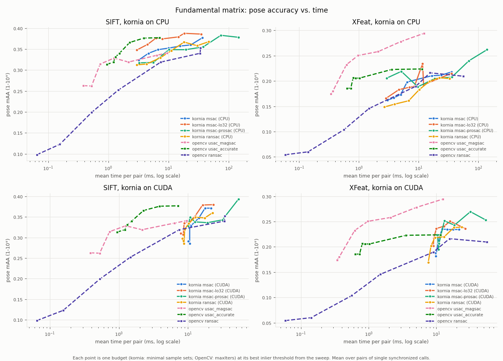
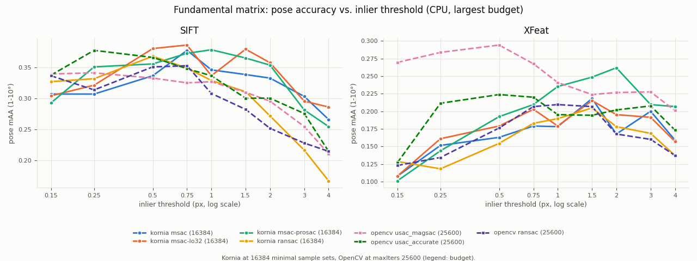

# Batched RANSAC: correctness, runtime, and pose accuracy

The original MSAC formula ranked point-model hypotheses by truncated squared loss,
but its acceptance and stopping logic incorrectly treated that score as an inlier
count. The PROSAC option did nothing. Local optimization was repeated full-inlier
refitting, rather than full LO-RANSAC. These are separate issues: changing a scoring
kernel alone would not repair the estimator.

## Summary

- **MSAC was broken; fixed, it is kornia's most accurate score.** At a 2-pixel threshold
  the base estimator never accepted a model: it returned its all-zero failure matrix for
  85--88% of SIFT pairs and every XFeat pair, after exhausting the whole sampling budget.
  The fixed MSAC fails on no pair, SIFT mAA rises from 0.09 to 0.39--0.45, and MSAC beats
  RANSAC scoring in 15 of 16 cells, by up to 0.11 mAA. It is also 2--9x faster on CPU
  (paired timings in one process).
- **The default path (`score_type="ransac"`) keeps its quality.** New minus base ranges
  from -0.022 to +0.050 mAA over 16 cells (mean +0.005). It is 1.01--1.11x faster on CPU
  and 0.91--0.95x on CUDA, where the new guards against nonfinite residuals and
  under-supported candidates add about 0.1--0.4 ms per call.
- **Local optimization pays off, but is expensive on CUDA.** On held-out scenes it adds
  0.03--0.14 mAA over no LO; `lo_sample_size=32` matched or beat full-inlier LO in 14 of
  16 cells. It costs under 1 ms per pair on CPU but 5--12 ms on CUDA, where the
  single-matrix eight-point solver is bound by kernel launches and synchronizations. A
  full-inlier refit that ties the score now replaces the minimal-sample model.
- **PROSAC now works; without its own termination test it is slow.** At an equal budget
  it gains up to 0.04 mAA at batch size 256 and at most 0.01 at 2048, but it always runs
  the full budget: 1.4--9x slower than uniform sampling with confidence stopping. On
  the accuracy-vs-time curve its largest budgets give kornia's best accuracy in three of
  the four panels, at the highest cost.
- **The inlier threshold matters more than any of these.** In the threshold sweep kornia
  is best at 0.5--0.75 px on SIFT (39 of 56 curve points) and 1.5--2 px on XFeat (36 of
  56), while OpenCV's MAGSAC++ prefers 0.15--0.25 px on SIFT and 0.5 px on XFeat. The
  fixed-threshold tables use 2 px throughout, which is too loose for kornia on SIFT:
  CUDA MSAC at 8192 sets scores 0.371 at 0.75 px and 0.309 at 2 px.
- **Against OpenCV (accuracy vs. time, each method at its best threshold).** On SIFT,
  kornia reaches the highest mAA (0.393 with PROSAC in 54 ms on CUDA; 0.388 with
  `lo_sample_size=32` in 18 ms on CPU), ahead of `USAC_ACCURATE` (0.377 in 7 ms) and
  `USAC_MAGSAC` (0.341). OpenCV gets there sooner: within 3 ms `USAC_ACCURATE` reaches
  0.366 against kornia's 0.348, and kornia on CUDA never runs below about 7.5 ms per
  pair. On XFeat, `USAC_MAGSAC` leads (0.294 in 12 ms); kornia's best is 0.270 (PROSAC,
  32 ms on CUDA).

## What changed

- **MSAC:** maximize `sum(1 - min(squared_error / threshold**2, 1))`. This is
  equivalent to minimizing the MSAC truncated quadratic. Keep support counts
  separate for eligibility and confidence stopping. Nonfinite residuals are outliers.
  Disqualify under-supported candidates before selecting the best model in a batch.
- **Stopping:** update support after accepted LO, round the without-replacement
  confidence bound upward using `log1p`, and check it on every batch, including
  batches that do not improve the incumbent. Count sampled sets, not solver roots.
  Insufficient support does not imply convergence after one sample. `confidence=1`
  disables early stopping; it used to stop after the first batch.
- **Validity:** reject zero and nonfinite matrices; retain valid minimal estimates
  even without enough points for the polisher. A failure returns a zero matrix and
  an `(N,)` false mask. Essential projection is followed by mask recomputation, and
  invalid essential refits are filtered before the projection's SVD. A zero
  fundamental matrix has zero Sampson error for every match, so it would otherwise
  win with full support. The solvers emitted none in our checks (for example, 12,288
  seven-point candidates from an IMC pair); the zeros in the base results are its
  failure return.
- **Line homographies:** the underlying helper returns an unsquared algebraic
  residual proportional to target-segment length. RANSAC now normalizes it by
  that length and squares it. Zero-length target segments are outliers.
- **Sampling:** CPU uses vectorized Floyd sampling without replacement, with
  storage proportional to `batch_size * sample_size`, rather than population size.
  CUDA retains random-key `topk`: small sequential sampling kernels were slower there.
- **PROSAC sampling:** best-first input, the original combinatorial growth
  recurrence, and forced inclusion of the newest correspondence during growth.
  The schedule advances per sampled set *inside* each batch. This implements the
  sampler, not the original prefix/non-randomness stopping test: it uses the full
  budget, without applying a uniform-draw confidence formula to biased draws.
- **LO:** default full-inlier refitting remains unchanged in form, but a refit that
  ties the incumbent's score now replaces it and ends LO. RANSAC scoring ties
  whenever support does not grow, and the least-squares refit on that support is
  more precise than the minimal-sample model it used to discard (on noise-free line
  segments, 2e-5 vs 1e-2 px in float32). Optional `lo_sample_size` fits
  `max_lo_iters` independent inlier subsets in one solver batch, then tries one
  full-inlier refit; subset fits must strictly improve the score.
  Consensus sets smaller than the cap use ordinary iterative refitting. This is
  bounded randomized LO, not complete LO+ with a threshold schedule.
- **Verification memory:** point metrics broadcast correspondences across models,
  avoiding redundant homogeneous-coordinate conversion of expanded point arrays.

For example, with 40 exact inliers and 60 outliers at a 2-pixel threshold, the old
score was `100 - 60*4 = -140`. The initial acceptance cutoff was the minimal sample
size, so the model was never retained. At thresholds below one, the score could
instead exceed support and terminate sampling prematurely.

References: [Torr and Zisserman, MLESAC/MSAC (2000)](https://robots.ox.ac.uk/~vgg/publications/2000/Torr00/),
[Chum and Matas, PROSAC (2005)](https://cmp.felk.cvut.cz/~matas/papers/chum-prosac-cvpr05.pdf),
[Chum et al., LO-RANSAC (2003)](https://cmp.felk.cvut.cz/~matas/papers/chum-dagm03.pdf),
[Lebeda et al., LO+ (2012)](https://cmp.felk.cvut.cz/software/LO-RANSAC/Lebeda-2012-Fixing_LORANSAC-BMVC_abstract.pdf).

## Evaluation protocol

Base: Kornia `0.9.0rc1`, commit `7ddf731b` (RANSAC source SHA-256 `404f18bc...`).
Changed: this branch (RANSAC source `1fcfd172...`). `kornia/geometry/ransac.py` is the
only library file that differs. Exact source hashes are recorded in each result JSON.
Python 3.11.14, PyTorch 2.14.0+cu130, OpenCV 4.11.0, Intel i7-14700K under WSL2
(four PyTorch and OpenCV threads), NVIDIA RTX 4090. Float32,
eight-point fundamental estimation, 2-pixel Sampson threshold, confidence 0.999,
at most 4096 minimal sample sets, batch sizes 256 and 2048, seeds 0/1/2. All-inlier
LO uses five iterations. Measured 2026-09-25.

The companion `imc2021-simple` project supplied raw, **pre-RANSAC** matches and
calibration. **Tuning set:** 20 common image pairs per scene from Sacre Coeur,
Reichstag, and St Peter's Square (NumPy selection seed 19): 60 image pairs, each with
SIFT and XFeat matches (120 feature/pair records). **Held-out set:** 10 pairs per
scene from British Museum, Florence Cathedral Side, Lincoln Memorial Statue, and
London Bridge (same seed): 80 records. No setting was chosen on the held-out set.
The feature caches are `raw_matches_n4096_r0.75.h5` and
`raw_matches_xfeat_n512_smnn_r0.95.h5`. Both cache `score` and `ratio` rank lower
values first; prefer `score` if both exist. Every sampler sees the same sorted
correspondences. This is not a comparison of feature extractors at equal extraction
budgets.

Quality uses the companion's unchanged `pose_error` and `maa_imc`: mean accuracy
at strict angular thresholds 1 through 10 degrees, using `max(rotation_error,
translation_error)`. Average scene/seed cells equally, separately per feature.
Retain failures in the denominator. "Failure" below means a nonfinite pose error;
a finite but inaccurate pose can still miss every mAA threshold. Seed-to-seed
standard deviation of a cell's mAA is typically 0.01--0.03, so smaller differences
are noise. This diagnostic subset is not an official IMC leaderboard evaluation or
proof of a universal gain.

Timing uses the harness's `compare` command, which loads the base revision's
`ransac.py` next to the branch's and times every variant in **one warmed process**:
separate processes on this hybrid CPU can differ by up to 2x on identical code.
Each call is timed with `benchmarks.common.time_us` (warmup, repeated synchronized
measurement) in three rounds, alternating the variant order, keeping the minimum
median. Two tuning pairs per scene/feature and three seeds give 18 measurements per
cell; tables report their median in ms, and "speedup" is the median of the 18
paired base/new ratios. Nothing else ran during timing. Inputs already reside on
the chosen device; timing includes sampling, fitting, scoring, and LO, but excludes
construction, sorting, transfers, and pose recovery. "Sets" is the median number of
sampled minimal sets over all quality runs. Quality is computed on all pairs, in
separate untimed runs. Different samplers need not draw identical sets, so
end-to-end differences include both work-count and kernel effects.

The **accuracy-vs-time curve** uses a separate set: 15 pairs per scene from all seven
scenes (selection seed 19), 105 pairs per feature, prepared as below and swept by the
harness's `sweep` command. The tables before it use the tuning and held-out sets at a
fixed 2-pixel threshold.

## Results
### Base vs changed (tuning set)

Fixed 2-pixel threshold; see the accuracy-vs-time section for per-method optima.

| Device | Feature | Batch | Score | mAA base → new | Failures base → new | Sets base → new | ms base → new | Speedup |
|---|---|---:|---|---|---|---|---|---:|
| CPU | SIFT | 256 | MSAC | 0.094 → 0.389 | 87% → 0% | 4096 → 512 | 36.5 → 4.1 | 9.23x |
| CPU | SIFT | 256 | RANSAC | 0.362 → 0.369 | 0% → 0% | 768 → 512 | 3.2 → 3.9 | 1.10x |
| CPU | SIFT | 2048 | MSAC | 0.093 → 0.454 | 87% → 0% | 4096 → 2048 | 34.1 → 15.8 | 2.09x |
| CPU | SIFT | 2048 | RANSAC | 0.344 → 0.343 | 0% → 0% | 2048 → 2048 | 17.4 → 16.0 | 1.11x |
| CPU | XFeat | 256 | MSAC | 0.000 → 0.275 | 100% → 0% | 4096 → 512 | 33.5 → 5.9 | 6.32x |
| CPU | XFeat | 256 | RANSAC | 0.281 → 0.271 | 0% → 0% | 640 → 512 | 4.4 → 4.0 | 1.01x |
| CPU | XFeat | 2048 | MSAC | 0.000 → 0.285 | 100% → 0% | 4096 → 2048 | 29.0 → 14.5 | 2.01x |
| CPU | XFeat | 2048 | RANSAC | 0.284 → 0.262 | 0% → 0% | 2048 → 2048 | 15.3 → 14.2 | 1.08x |
| CUDA | SIFT | 256 | MSAC | 0.093 → 0.405 | 87% → 0% | 4096 → 512 | 34.5 → 14.4 | 2.13x |
| CUDA | SIFT | 256 | RANSAC | 0.375 → 0.389 | 0% → 0% | 768 → 512 | 10.4 → 11.1 | 0.91x |
| CUDA | SIFT | 2048 | MSAC | 0.094 → 0.434 | 87% → 0% | 4096 → 2048 | 10.1 → 9.9 | 1.16x |
| CUDA | SIFT | 2048 | RANSAC | 0.350 → 0.353 | 0% → 0% | 2048 → 2048 | 7.5 → 8.2 | 0.92x |
| CUDA | XFeat | 256 | MSAC | 0.000 → 0.246 | 100% → 0% | 4096 → 512 | 33.5 → 12.9 | 2.72x |
| CUDA | XFeat | 256 | RANSAC | 0.246 → 0.240 | 0% → 0% | 768 → 512 | 16.5 → 11.7 | 0.95x |
| CUDA | XFeat | 2048 | MSAC | 0.000 → 0.303 | 100% → 0% | 4096 → 2048 | 9.6 → 11.6 | 0.85x |
| CUDA | XFeat | 2048 | RANSAC | 0.253 → 0.254 | 0% → 0% | 2048 → 2048 | 7.1 → 7.7 | 0.93x |

### Held-out scenes

| Device | Feature | Batch | MSAC base → new | Failures base → new | RANSAC base → new |
|---|---|---:|---|---|---|
| CPU | SIFT | 256 | 0.038 → 0.232 | 85% → 0% | 0.223 → 0.216 |
| CPU | SIFT | 2048 | 0.027 → 0.270 | 88% → 0% | 0.186 → 0.184 |
| CPU | XFeat | 256 | 0.000 → 0.144 | 100% → 0% | 0.109 → 0.113 |
| CPU | XFeat | 2048 | 0.000 → 0.174 | 100% → 0% | 0.169 → 0.219 |
| CUDA | SIFT | 256 | 0.046 → 0.312 | 88% → 0% | 0.202 → 0.246 |
| CUDA | SIFT | 2048 | 0.027 → 0.302 | 86% → 0% | 0.196 → 0.208 |
| CUDA | XFeat | 256 | 0.000 → 0.171 | 100% → 0% | 0.152 → 0.166 |
| CUDA | XFeat | 2048 | 0.000 → 0.223 | 100% → 0% | 0.207 → 0.191 |

### Local optimization (MSAC, uniform sampling)

mAA on the tuning and held-out sets, and median time on the tuning set.

| Device | Feature | Batch | Row | No LO | Full-inlier LO (default) | `lo_sample_size=32` | `lo_sample_size=128` |
|---|---|---:|---|---:|---:|---:|---:|
| CPU | SIFT | 256 | tuning mAA | 0.357 | 0.389 | 0.411 | 0.392 |
| CPU | SIFT | 256 | held-out mAA | 0.146 | 0.232 | 0.253 | – |
| CPU | SIFT | 256 | ms | 3.3 | 4.1 | 4.0 | 3.8 |
| CPU | SIFT | 2048 | tuning mAA | 0.451 | 0.454 | 0.448 | 0.457 |
| CPU | SIFT | 2048 | held-out mAA | 0.221 | 0.270 | 0.297 | – |
| CPU | SIFT | 2048 | ms | 15.7 | 15.8 | 16.1 | 16.1 |
| CPU | XFeat | 256 | tuning mAA | 0.271 | 0.275 | 0.279 | 0.276 |
| CPU | XFeat | 256 | held-out mAA | 0.076 | 0.144 | 0.157 | – |
| CPU | XFeat | 256 | ms | 5.2 | 5.9 | 6.0 | 5.8 |
| CPU | XFeat | 2048 | tuning mAA | 0.279 | 0.285 | 0.292 | 0.284 |
| CPU | XFeat | 2048 | held-out mAA | 0.117 | 0.174 | 0.217 | – |
| CPU | XFeat | 2048 | ms | 13.8 | 14.5 | 14.4 | 14.6 |
| CUDA | SIFT | 256 | tuning mAA | 0.404 | 0.405 | 0.430 | 0.419 |
| CUDA | SIFT | 256 | held-out mAA | 0.175 | 0.312 | 0.327 | – |
| CUDA | SIFT | 256 | ms | 2.8 | 14.4 | 8.7 | 7.6 |
| CUDA | SIFT | 2048 | tuning mAA | 0.434 | 0.434 | 0.435 | 0.436 |
| CUDA | SIFT | 2048 | held-out mAA | 0.229 | 0.302 | 0.311 | – |
| CUDA | SIFT | 2048 | ms | 5.0 | 9.9 | 9.5 | 9.4 |
| CUDA | XFeat | 256 | tuning mAA | 0.213 | 0.246 | 0.267 | 0.249 |
| CUDA | XFeat | 256 | held-out mAA | 0.140 | 0.171 | 0.181 | – |
| CUDA | XFeat | 256 | ms | 6.4 | 12.9 | 8.8 | 13.6 |
| CUDA | XFeat | 2048 | tuning mAA | 0.298 | 0.303 | 0.296 | 0.303 |
| CUDA | XFeat | 2048 | held-out mAA | 0.192 | 0.223 | 0.248 | – |
| CUDA | XFeat | 2048 | ms | 5.0 | 11.6 | 9.3 | 11.8 |

### PROSAC at an equal budget (tuning set)

`confidence=1` makes uniform sampling run the same 4096 sets as PROSAC; the last column
compares uniform sampling with confidence stopping against PROSAC's full budget.

| Device | Feature | Batch | MSAC uniform | MSAC PROSAC | RANSAC uniform | RANSAC PROSAC | ms uniform (early stop) → PROSAC, MSAC |
|---|---|---:|---:|---:|---:|---:|---|
| CPU | SIFT | 256 | 0.411 | 0.449 | 0.347 | 0.353 | 4.1 → 36.7 |
| CPU | SIFT | 2048 | 0.444 | 0.448 | 0.334 | 0.359 | 15.8 → 31.8 |
| CPU | XFeat | 256 | 0.291 | 0.291 | 0.285 | 0.277 | 5.9 → 35.1 |
| CPU | XFeat | 2048 | 0.293 | 0.292 | 0.278 | 0.259 | 14.5 → 27.9 |
| CUDA | SIFT | 256 | 0.435 | 0.453 | 0.356 | 0.334 | 14.4 → 51.0 |
| CUDA | SIFT | 2048 | 0.434 | 0.443 | 0.347 | 0.341 | 9.9 → 14.9 |
| CUDA | XFeat | 256 | 0.274 | 0.309 | 0.263 | 0.258 | 12.9 → 50.4 |
| CUDA | XFeat | 2048 | 0.297 | 0.299 | 0.258 | 0.272 | 11.6 → 16.1 |

### Accuracy vs. time (IMC style)



Each point is one compute budget: kornia minimal-sample budgets 256--16384 (batches of
256 on CPU and 2048 on CUDA; a smaller budget runs as one batch) and OpenCV `maxIters`
10--25600. Its y value is the best mAA over the inlier thresholds 0.15, 0.25, 0.5, 0.75, 1,
1.5, 2, 3 and 4 px at that budget, and its x value the mean time per pair of single
synchronized calls at that threshold (so a line can step back in time where a looser
threshold stopped earlier). Confidence 0.999, seed 0, four PyTorch and OpenCV threads;
OpenCV runs on the CPU and is repeated in the CUDA row as the reference. Kornia's CUDA
rows are in the regime this change does not address: one image pair per call, where the
per-call cost of the solver and of LO dominates. Choosing the best threshold on the
evaluation data is optimistic for every method alike, so compare methods rather than
absolute values. The same construction as the F-matrix curve in `ds-sac` and the IMC paper.
Curve points: [`ransac_time_maa.json`](ransac_time_maa.json).

Best mAA reachable within a mean time per pair:

#### SIFT

| Method | Device | mAA within 3 ms | 10 ms | 30 ms | best (ms, threshold) |
|---|---|---:|---:|---:|---|
| kornia msac-prosac | CUDA | – | 0.329 | 0.350 | 0.393 (53.7 ms, 0.75 px) |
| kornia msac-lo32 | CPU | 0.348 | 0.376 | 0.388 | 0.388 (18.2 ms, 1.5 px) |
| kornia msac-prosac | CPU | – | 0.318 | 0.349 | 0.383 (74.5 ms, 1 px) |
| kornia msac-lo32 | CUDA | – | 0.335 | 0.380 | 0.380 (23.3 ms, 0.5 px) |
| kornia msac | CPU | – | 0.349 | 0.360 | 0.377 (36.8 ms, 0.75 px) |
| opencv usac_accurate | CPU | 0.366 | 0.377 | 0.377 | 0.377 (7.1 ms, 0.25 px) |
| kornia msac | CUDA | – | – | 0.371 | 0.371 (17.6 ms, 0.75 px) |
| kornia ransac | CPU | 0.312 | 0.330 | 0.367 | 0.368 (46.8 ms, 0.5 px) |
| kornia ransac | CUDA | – | 0.320 | 0.360 | 0.360 (22.6 ms, 0.5 px) |
| opencv ransac | CPU | 0.252 | 0.319 | 0.319 | 0.352 (34.1 ms, 0.75 px) |
| opencv usac_magsac | CPU | 0.329 | 0.341 | 0.341 | 0.341 (9.5 ms, 0.25 px) |

#### XFeat

| Method | Device | mAA within 3 ms | 10 ms | 30 ms | best (ms, threshold) |
|---|---|---:|---:|---:|---|
| opencv usac_magsac | CPU | 0.258 | 0.278 | 0.294 | 0.294 (12.4 ms, 0.5 px) |
| kornia msac-prosac | CUDA | – | – | 0.251 | 0.270 (31.8 ms, 1.5 px) |
| kornia msac-prosac | CPU | 0.206 | 0.219 | 0.219 | 0.262 (140.8 ms, 2 px) |
| kornia msac-lo32 | CUDA | – | 0.236 | 0.250 | 0.250 (15.9 ms, 1.5 px) |
| kornia ransac | CUDA | – | 0.218 | 0.239 | 0.239 (23.6 ms, 1 px) |
| kornia msac | CUDA | – | 0.188 | 0.235 | 0.235 (12.2 ms, 1.5 px) |
| kornia msac-lo32 | CPU | 0.166 | 0.190 | 0.234 | 0.234 (11.7 ms, 3 px) |
| opencv usac_accurate | CPU | 0.207 | 0.223 | 0.224 | 0.224 (11.5 ms, 0.5 px) |
| kornia msac | CPU | – | 0.198 | 0.211 | 0.218 (35.9 ms, 1.5 px) |
| opencv ransac | CPU | 0.146 | 0.190 | 0.216 | 0.216 (15.6 ms, 1.5 px) |
| kornia ransac | CPU | 0.149 | 0.161 | 0.207 | 0.207 (22.4 ms, 1.5 px) |

Threshold sensitivity at each method's largest CPU budget:



Kornia's scores peak at 0.5--1 px on SIFT and 1.5--2 px on XFeat and fall off on both
sides; `USAC_ACCURATE` peaks at 0.25 px on SIFT and `USAC_MAGSAC` at 0.5 px on XFeat.
A 2-pixel threshold costs every method accuracy on SIFT.

Three `USAC_MAGSAC` runs at 0.15 px raised an OpenCV assertion (`sample_size <=
points_size_`); they count as failed estimates. `USAC_MAGSAC` still picks 0.15 px, the
smallest value in the grid, at two SIFT budgets, so it might gain slightly below it.

## Follow-ups

- **CUDA per-call cost.** A batch-size-one `find_fundamental` on CUDA takes 1.3 ms (about
  86 kernel launches and six host synchronizations, including `eigh`, a 3x3 SVD and their
  error checks), and verifying one model 0.65 ms. That is a shared-solver optimization.
  Estimating many image pairs per call would be kornia's natural GPU regime; the current
  `RANSAC` API takes one pair.
- **PROSAC termination.** Chum and Matas stop once a prefix passes their non-randomness
  and maximality tests. Without them PROSAC cannot stop early.
- **Defaults.** MSAC scoring, `lo_sample_size=32`, and a threshold near 1 px were at
  least as accurate here as the current defaults (`ransac`, full-inlier LO, 2 px).
  Changing defaults changes results for existing users, so it is left out of this change.
- **Scoring.** The XFeat gap to `USAC_MAGSAC` suggests sigma-consensus scoring; the
  polisher already carries a `TODO: Replace this with MAGSAC++ polisher`.

## Reproduce

Use an environment with the companion project and `h5py` for preparation and
scoring; the measurement environment needs only Kornia, PyTorch, and NumPy.
Preparation and evaluation do not modify the original caches.

```bash
python benchmarks/geometry/ransac.py prepare \
  --data-root ../imc2021-simple/data/phototourism \
  --scenes sacre_coeur,reichstag,st_peters_square \
  --cache sift=raw_matches_n4096_r0.75.h5 \
  --cache xfeat=raw_matches_xfeat_n512_smnn_r0.95.h5 \
  --pairs 20 --selection-seed 19 --npz /tmp/ransac-imc-120.npz

.venv/bin/python benchmarks/geometry/ransac.py run \
  --npz /tmp/ransac-imc-120.npz --device cpu --batches 256,2048 \
  --sample-budget 4096 --scores ransac,msac --prosac off,on \
  --lo-iters 5 --seeds 0,1,2 --threshold 2 --timing-pairs 0 \
  --json /tmp/ransac-quality.json

python benchmarks/geometry/ransac.py evaluate \
  --npz /tmp/ransac-imc-120.npz --predictions /tmp/ransac-quality.json \
  --json /tmp/ransac-quality-evaluated.json
```

Repeat with `--device cuda`. For the held-out set, prepare with
`--scenes british_museum,florence_cathedral_side,lincoln_memorial_statue,london_bridge
--pairs 10`. For LO ablations, use `--scores msac --prosac off` and either
`--lo-iters 0`, or `--lo-iters 5 --lo-sample-size 32` / `128`. For the equal-budget
PROSAC control, add `--confidence 1`.

For base quality, copy this harness into the baseline checkout and run it from that
checkout using the **same explicit interpreter**, with `--prosac off` (the old flag is
a no-op) and without `--lo-sample-size`. Check the printed Kornia source path.
Dataset, evaluator, and measured library source hashes are recorded in JSON; never
infer the imported revision from the current directory.

Timing:

```bash
git show 7ddf731b:kornia/geometry/ransac.py > /tmp/base_ransac.py
.venv/bin/python benchmarks/geometry/ransac.py compare --npz /tmp/ransac-imc-120.npz \
  --device cpu --base-source /tmp/base_ransac.py --json /tmp/ransac-compare-cpu.json
```

The accuracy-vs-time curve:

```bash
python benchmarks/geometry/ransac.py prepare \
  --data-root ../imc2021-simple/data/phototourism \
  --scenes sacre_coeur,reichstag,st_peters_square,british_museum,florence_cathedral_side,lincoln_memorial_statue,london_bridge \
  --cache sift=raw_matches_n4096_r0.75.h5 \
  --cache xfeat=raw_matches_xfeat_n512_smnn_r0.95.h5 \
  --pairs 15 --selection-seed 19 --npz /tmp/ransac-curve.npz
.venv/bin/python benchmarks/geometry/ransac.py sweep --npz /tmp/ransac-curve.npz \
  --device cpu --batch 256 --thresholds 0.15,0.25,0.5,0.75,1,1.5,2,3,4 --json /tmp/sweep-cpu.json
.venv/bin/python benchmarks/geometry/ransac.py sweep --npz /tmp/ransac-curve.npz \
  --device cuda --batch 2048 --opencv "" --thresholds 0.15,0.25,0.5,0.75,1,1.5,2,3,4 \
  --json /tmp/sweep-cuda.json
python benchmarks/geometry/ransac.py evaluate --npz /tmp/ransac-curve.npz \
  --predictions /tmp/sweep-cpu.json --json /tmp/sweep-cpu-evaluated.json  # and CUDA
.venv/bin/python benchmarks/geometry/ransac.py plot \
  --evaluated /tmp/sweep-cpu-evaluated.json /tmp/sweep-cuda-evaluated.json \
  --out benchmarks/geometry/ransac_time_maa.png --dpi 100 \
  --points-json benchmarks/geometry/ransac_time_maa.json \
  --threshold-out benchmarks/geometry/ransac_threshold_maa.png
```

The sweep takes about 30 minutes on CPU and 15 on CUDA here.
