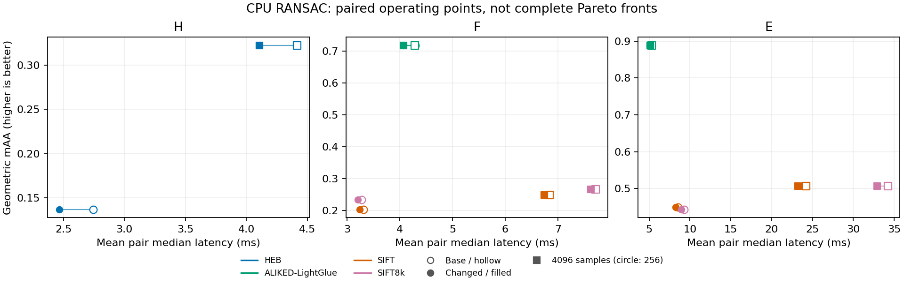

# CPU RANSAC efficiency

This comparison measures public H/F/E `RANSAC.forward` calls against the previous implementation. It tests geometric quality as well as latency: a faster run that returns worse geometry is not automatically an improvement.

The retained changes reduce verification temporaries, avoid unnecessary refinement work, and replace general powers in the five-point Newton correction with bounded cumulative products. Hypothesis verification is tiled independently of the solve batch, with about one million residual entries per CPU tile. Correspondence reductions stay whole. PROSAC keeps the masks from those exact evaluations for its stopping rule. The final refinement compacts a singleton boolean inlier mask before constructing its equations.

## Measurement

Intel Core i7-14700K under WSL2, four PyTorch/OpenCV threads, Python 3.11.14, PyTorch 2.14.0+cu130, float32 CPU inputs. Base revision: `efed254b`. Changed revision: `ad62063b`. All four implementation-file hashes are recorded in each result file. The harness checks the imported checkout and prints the interpreter.

There are 200 HEB NYC Library pairs for H, and 170 PhotoTourism pairs each for F and E: 70 ALIKED-LightGlue, 70 SIFT, and 30 SIFT8k. Learned/SIFT matches cover seven scenes, SIFT8k three. Median retained correspondences are 481 for H, 577 for learned matches, about 98 for SIFT, and 99 for SIFT8k (the name describes extracted features, not retained matches). This dataset therefore does not represent verification over thousands of retained matches. Quality uses seeds 0, 1, and 2, with scenes and seeds weighted equally within each feature. Budgets are 256 and 4096 minimal samples; confidence is 0.999. H uses the HEB SNN<0.8 filter; PhotoTourism preserves exported correspondence order. Sampling, scoring, local optimization, and final refinement use the public defaults.

Pixel thresholds are H=8, SIFT=0.75, SIFT8k=0.5, and ALIKED-LightGlue=1.5. E normalizes image coordinates by calibration and divides the threshold by mean focal length. H mAA uses ten logarithmic reprojection thresholds from 1 to 20 pixels; F/E mAA uses strict pose thresholds from 1 to 10 degrees. Failures count as misses.

Timing uses warmed, repeated seed-zero calls through `common.time_us`, with a minimum 0.1 seconds per pair/budget and per-pair median/IQR stored. The table reports the arithmetic mean of those per-pair medians. Input loading, estimator construction, and pose recovery are excluded. Runs were sequential, without simultaneous tests or other benchmark jobs from this task. Timing variability under WSL2 remains relevant for small differences.

| Model / matches | Budget | Base ms | Changed ms | Speed ratio | Base mAA | Changed mAA |
| --- | ---: | ---: | ---: | ---: | ---: | ---: |
| E / aliked_lightglue | 256 | 5.321 | 5.105 | 1.04× | 0.8886 | 0.8886 |
| E / aliked_lightglue | 4096 | 5.319 | 5.132 | 1.04× | 0.8886 | 0.8886 |
| E / sift | 256 | 8.544 | 8.236 | 1.04× | 0.4490 | 0.4490 |
| E / sift | 4096 | 24.203 | 23.215 | 1.04× | 0.5067 | 0.5067 |
| E / sift8k | 256 | 9.305 | 8.952 | 1.04× | 0.4433 | 0.4433 |
| E / sift8k | 4096 | 34.227 | 32.911 | 1.04× | 0.5067 | 0.5067 |
| F / aliked_lightglue | 256 | 4.292 | 4.067 | 1.06× | 0.7181 | 0.7181 |
| F / aliked_lightglue | 4096 | 4.281 | 4.067 | 1.05× | 0.7181 | 0.7181 |
| F / sift | 256 | 3.308 | 3.242 | 1.02× | 0.2033 | 0.2033 |
| F / sift | 4096 | 6.845 | 6.740 | 1.02× | 0.2495 | 0.2495 |
| F / sift8k | 256 | 3.276 | 3.204 | 1.02× | 0.2344 | 0.2344 |
| F / sift8k | 4096 | 7.721 | 7.628 | 1.01× | 0.2667 | 0.2667 |
| H / heb | 256 | 2.744 | 2.467 | 1.11× | 0.1365 | 0.1365 |
| H / heb | 4096 | 4.417 | 4.106 | 1.08× | 0.3227 | 0.3227 |



All 14 aggregate mAA values match the baseline. H improves by 1.08–1.11×, F by 1.01–1.06×, and E by about 1.04× in this run. The 1–2% F/SIFT differences are small enough to treat as near-neutral. These modest gains are not evidence that the gap to native CPU estimators is closed.

These are two operating budgets, not a complete Pareto frontier. They do not establish dominance over OpenCV or PoseLib; those libraries are not timed by this A/B harness. Latency covers seed zero while quality covers all three seeds. Changes in floating-point rounding can affect discrete ranking, support, and downstream refinement even when the sampling schedule stays fixed.

## Batch experiments

Geometrically growing batches already existed in the baseline. We tested more aggressive opening sizes rather than assuming that smaller always helps. The final defaults retain H=512, F=256, and E=64 opening samples, doubling toward the existing caps of 4096, 2048, and 1024 respectively. Explicit integer batch sizes are preserved.

The [rejected full candidate](ransac_cpu_results/rejected-smaller-batches.json) used H=128 with quadrupling and E=32 with doubling. On 200 H pairs, low-budget mAA fell from 0.1365 to 0.1308 and latency rose from 2.744 to 2.903 ms. At budget 4096, H mAA improved from 0.3227 to 0.3297 with approximately unchanged latency. E on learned matches sped up from 5.321 to 4.947 ms but mAA fell from 0.8886 to 0.8814. At budget 256, E/SIFT8k mAA fell from 0.4433 to 0.4211 while latency increased from 9.305 to 10.395 ms. Smaller F openings also hurt learned/SIFT8k quality in the pilot. This full candidate also used trial-first LM, so its runtime changes are not a schedule-only ablation. Those quality tradeoffs did not justify changing defaults. Smaller batches check stopping earlier, but also pay another controller/solver/refinement setup and offer fewer candidates before stopping.

## Solver and refinement experiments

The five-point companion eigenvalue solver remains in place. A pure-PyTorch Sturm prototype was much slower in the diagnostic root microbenchmark; a sparse determinant-expansion prototype also lost to the existing coefficient construction. The retained change only optimizes bounded polynomial powers used for the implicit Newton correction, preserving the root ordering, validity masks, and gradient construction.

CPU refinement evaluates only the cost on its final trial and returns the selected model without constructing an unused Jacobian or optimizer state. Earlier iterations retain fused residual/Jacobian evaluation. Trial-cost-first evaluation on every iteration looked promising in isolated long-loop measurements, but lost on the short public RANSAC runs; removing it improved H/F timings in the ablation with identical measured mAA. Differentiable and accelerator calls retain their vectorized path. The implementation adds no runtime dependency or automatic compilation cost. Reduced allocation matters most for large model-by-correspondence verification workloads; it does not remove eager PyTorch dispatch overhead from small CPU calls.

## Reproduction and artifacts

Use the same environment and this harness in two disposable checkouts. Copy `benchmarks/geometry/ransac_cpu.py` into the base checkout, where it is untracked, and run from each checkout root:

```bash
"$task_python" benchmarks/geometry/ransac_cpu.py \
  --npz "$task_data/phototourism-7x10.npz" \
  --heb "$task_data/NYC_Library_homographies.h5" \
  --pairs 10 --h-pairs 200 --models H,F,E \
  --budgets 256,4096 --seeds 0,1,2 --threads 4 \
  --json "$task_scratch/results.json"
```

[Raw per-pair results](ransac_cpu_results/) are split by revision, model, and budget. They include dataset hashes, errors, support counts, medians/IQRs, and source hashes. The baseline harness predated metadata-only additions for source/harness hashes, units, `batch=1`, and reciprocal throughput; these fields were filled after measurement. The timed calls and quality calculations are identical, and no measured value was changed. Each shard identifies its subset; the original run selection remains in metadata.

## Validation

- CPU float32/float64: 1083 passed, 42 skipped, 10 non-strict XPASS; two expected SVD-convergence warnings.
- Focused CPU float16/bfloat16: 51 passed, 24 skipped.
- CUDA float32/float64 RANSAC/essential: 492 passed, 51 skipped, 1 XFAIL, 7 non-strict XPASS after excluding one failure reproduced on the unchanged baseline. The excluded `TestFindEssential::test_null_space_gradient_of_a_discarded_sample[cuda]` expects nonfinite gradients for a rank-deficient design; both revisions produce large finite gradients on this stack. It is not fixed by this change.
- Both benchmark-artifact schema tests pass. Full `pixi run pre-commit-all` and `pixi run typecheck` pass.

Tests cover score/support/mask agreement, invalid models, input preservation, bounded polynomial powers, CPU refinement versus the differentiable reference, weighted and empty masks, and mixed acceptance. The planar E test now checks consensus, essential singular values, and residuals rather than equality to one generating motion: different seeds on the unchanged baseline recover different valid motions for the same plane.
