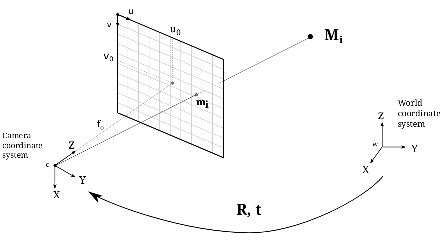

Pinhole Camera
--------------

.. currentmodule:: kornia.geometry.camera.pinhole

.. warning::
   :mod:`kornia.geometry.camera` will be deprecated in future versions. Please use
   :mod:`kornia.sensors.camera` instead.

In this module we have all the functions and data structures needed to describe the projection of a 3D scene space onto a 2D image plane.

In computer vision, we can map between the 3D world and a 2D image using *projective geometry*. The module implements the simplest camera model, the **Pinhole Camera**, which is the most basic model for general projective cameras from the finite cameras group.

The Pinhole Camera model is shown in the following figure:

Using this model, a scene view can be formed by projecting 3D points into the image plane using a perspective transformation.

.. math::
    s  \; m' = K [R|t] M'

or

.. math::
    s \begin{bmatrix} u \\ v \\ 1\end{bmatrix} =
    \begin{bmatrix}
    f_x & 0 & u_0 \\
    0 & f_y & v_0 \\
    0 & 0 & 1
    \end{bmatrix}
    \begin{bmatrix}
    r_{11} & r_{12} & r_{13} & t_1  \\
    r_{21} & r_{22} & r_{23} & t_2  \\
    r_{31} & r_{32} & r_{33} & t_3
    \end{bmatrix}
    \begin{bmatrix}
    X \\
    Y \\
    Z \\
    1
    \end{bmatrix}

where:
    * :math:`M'` is a 3D point in space with coordinates :math:`[X,Y,Z]^T` expressed in an Euclidean coordinate frame known as the *world coordinate system*.
    * :math:`m'` is the projection of the 3D point :math:`M'` onto the *image plane* with coordinates :math:`[u,v]^T` expressed in pixel units.
    * :math:`K` is the *camera calibration matrix*, also referred as the intrinsic matrix.
    * :math:`C` is the *principal point offset* with coordinates :math:`[u_0, v_0]^T` at the origin in the image plane.
    * :math:`fx, fy` are the focal lengths expressed in pixel units.

The camera rotation and translation are expressed in terms of an Euclidean coordinate frame known as the *world coordinate system*. These terms are usually expressed by the joint rotation-translation matrix :math:`[R|t]` which is also known as the extrinsic matrix. It is used to describe the camera pose around a static scene and transforms the coordinates of a 3D point :math:`(X,Y,Z)` from the *world coordinate system* to the *camera coordinate system*.

The :class:`PinholeCamera` expects the *intrinsic matrices* and the *extrinsic matrices*
to be of shape `(B, 4, 4)` such that each *intrinsic matrix* has the following format:

.. math::
    \begin{bmatrix}
    f_x & 0 & u_0 & 0\\
    0 & f_y & v_0 & 0\\
    0 & 0 & 1 & 0 \\
    0 & 0 & 0 & 1
    \end{bmatrix}

And each *extrinsic matrix* has the following format:

.. math::
    \begin{bmatrix}
    r_{11} & r_{12} & r_{13} & t_1  \\
    r_{21} & r_{22} & r_{23} & t_2  \\
    r_{31} & r_{32} & r_{33} & t_3  \\
    0      & 0      & 0      & 1
    \end{bmatrix}

.. autoclass:: PinholeCamera
    :members:

.. autofunction:: cam2pixel
.. autofunction:: pixel2cam
