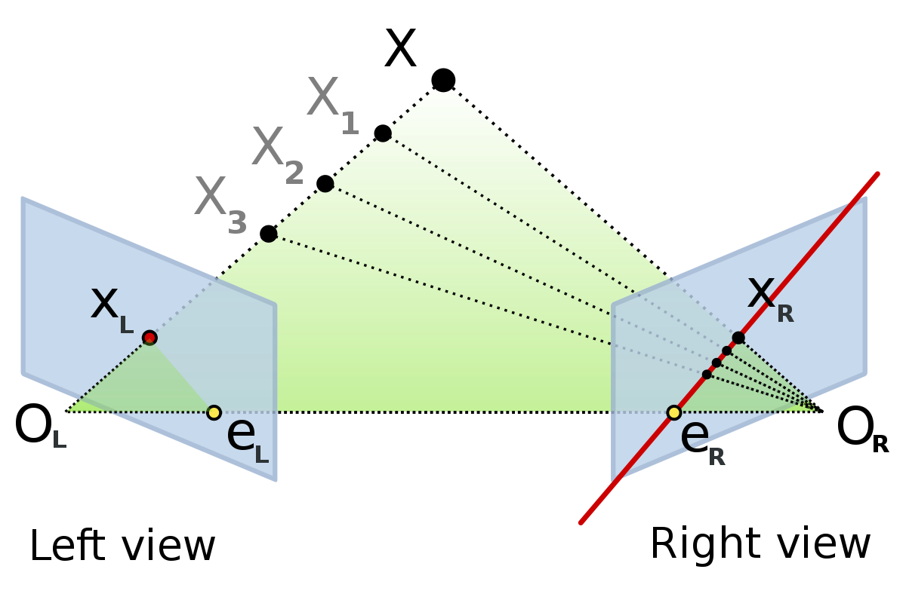

kornia.geometry.epipolar
========================

.. currentmodule:: kornia.geometry.epipolar

Module to with useful functionalities for epipolar geometry used by Structure from Motion

Essential
---------

.. autofunction:: essential_from_fundamental
.. autofunction:: essential_from_Rt
.. autofunction:: decompose_essential_matrix
.. autofunction:: motion_from_essential
.. autofunction:: motion_from_essential_choose_solution
.. autofunction:: relative_camera_motion

Fundamental
-----------

.. autofunction:: find_fundamental
.. autofunction:: fundamental_from_essential
.. autofunction:: fundamental_from_projections
.. autofunction:: compute_correspond_epilines
.. autofunction:: normalize_points
.. autofunction:: normalize_transformation

Metrics
-------

.. autofunction:: sampson_epipolar_distance
.. autofunction:: symmetrical_epipolar_distance

Projection
----------

.. autofunction:: projection_from_KRt
.. autofunction:: projections_from_fundamental
.. autofunction:: intrinsics_like
.. autofunction:: scale_intrinsics
.. autofunction:: random_intrinsics

Numeric
-------

.. autofunction:: cross_product_matrix
.. autofunction:: eye_like
.. autofunction:: vec_like

Triangulation
-------------

.. autofunction:: triangulate_points
