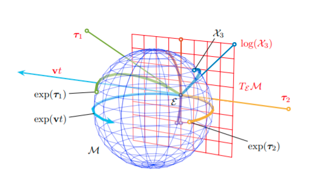
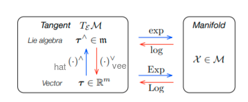

kornia.geometry.liegroup
==========================

.. currentmodule:: kornia.geometry.liegroup

The Lie group encompasses the concepts of `group` and `smooth manifold` in a unique body.

A group is a non-empty set with an operation that satisfies the following constraints: the operation is associative, has an identity element,
and every element of the set has an inverse element.

See more: `Group <https://en.wikipedia.org/wiki/Group_(mathematics)>`_

A Lie group :math:`G` is a smooth manifold whose elements satisfy the group axioms.You can visualize the idea of manifold like a curved, smooth (hyper)-surface, with no edges or
spikes, embedded in a space of higher dimension.

See more: `Manifold <https://en.wikipedia.org/wiki/Manifold>`_

In robotics, we say that our state vector evolves on this surface, that is, the manifold describes or is defined by the constraints imposed on
the state.

lie algebra
==========================

If :math:`M` is the manifold that represents a lie group, the tangent space at the identity is called the Lie algebra of :math:`M`.
The Lie algebra :math:`m` is a vector space. As such, its elements can be identified with vectors in :math:`R^d`, whose
dimension :math:`d` is the number of degrees of freedom of :math:`M`. For example :math:`d` would be 3 in the case of lie group :math:`SO3`

lie group and lie algebra
==========================

Every Lie group has an associated Lie algebra. We relate the
Lie group with its Lie algebra through the following facts

#. The Lie algebra :math:`m` is a vector space. As such, its elements can be identified with vectors in :math:`R^d`, whose
   dimension :math:`d` is the number of degrees of freedom of :math:`M`.

#. The exponential map, `exp` : :math:`m` → :math:`M`, exactly converts elements of the Lie algebra into elements of the group.
   The `log` map is the inverse operation.

Reference: `Micro lie theory <https://arxiv.org/pdf/1812.01537.pdf>`_

.. autoclass:: So3
   :members:
   :special-members:

.. autoclass:: Se3
   :members:
   :special-members:

.. autoclass:: So2
   :members:
   :special-members:

.. autoclass:: Se2
   :members:
   :special-members:
