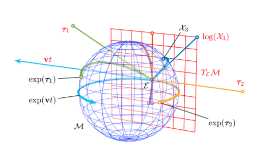
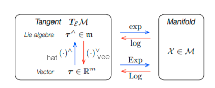

kornia.geometry.liegroup
==========================

.. meta::
   :description: The kornia.geometry.liegroup module provides mathematical tools and operations for working with Lie groups and Lie algebras, which are fundamental in many areas of robotics and computer vision. Lie groups describe smooth manifolds that satisfy group axioms, while Lie algebras represent the tangent space at the identity element of these groups. This module includes key classes for common Lie groups like `SO2`, `SO3`, `SE2`, and `SE3`, and provides functions for performing operations like the exponential and logarithmic maps, which connect Lie algebras and Lie groups.

.. currentmodule:: kornia.geometry.liegroup

A Lie group combines the concepts of a *group* and a *smooth manifold* in a single object.

A group is a non-empty set with an operation that satisfies the following constraints: the operation is associative, has an identity element,
and every element of the set has an inverse element.

See more: `Group <https://en.wikipedia.org/wiki/Group_(mathematics)>`_

A Lie group :math:`G` is a smooth manifold whose elements satisfy the group axioms. You can visualize a manifold as a curved, smooth (hyper-)surface, with no edges or
spikes, embedded in a space of higher dimension.

See more: `Manifold <https://en.wikipedia.org/wiki/Manifold>`_

In robotics, we say that our state vector evolves on this surface; that is, the manifold describes, or is defined by, the constraints imposed on
the state.

Lie algebra
-----------

If :math:`M` is the manifold that represents a Lie group, the tangent space at the identity is called the Lie algebra of :math:`M`.
The Lie algebra :math:`m` is a vector space. As such, its elements can be identified with vectors in :math:`R^d`, whose
dimension :math:`d` is the number of degrees of freedom of :math:`M`. For example, :math:`d = 3` for the Lie group :math:`SO(3)`.

Lie group and Lie algebra
-------------------------

Every Lie group has an associated Lie algebra. We relate the
Lie group to its Lie algebra through the following facts:

#. The Lie algebra :math:`m` is a vector space. As such, its elements can be identified with vectors in :math:`R^d`, whose
   dimension :math:`d` is the number of degrees of freedom of :math:`M`.

#. The exponential map, :math:`\exp : m \rightarrow M`, exactly converts elements of the Lie algebra into elements of the group.
   The :math:`\log` map is the inverse operation.

Reference: `A micro Lie theory for state estimation in robotics <https://arxiv.org/pdf/1812.01537.pdf>`_

Classes
-------

.. autoclass:: So3
   :members:
   :special-members:

.. autoclass:: Se3
   :members:
   :special-members:

.. autoclass:: So2
   :members:
   :special-members:

.. autoclass:: Se2
   :members:
   :special-members:
