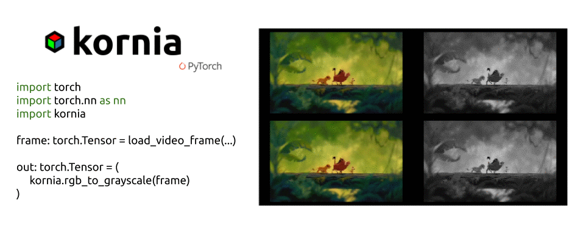

What is Kornia?
===============

.. meta::
   :description: Kornia is a differentiable computer vision library built on PyTorch. Learn what the library is, how it bridges classical and deep computer vision, and what each of its modules provides.

Kornia is a differentiable library that allows classical computer vision to be integrated into deep learning models.

It consists of a set of routines and differentiable modules to solve generic computer vision problems.
At its core, the package uses PyTorch as its main backend both for efficiency and to take advantage of
the reverse-mode auto-differentiation to define and compute the gradient of complex functions.

The library is composed of a set of packages containing operators that can be inserted
within neural networks to train models to perform image transformations, epipolar geometry, depth estimation,
and low-level image processing such as filtering and edge detection, all operating directly on tensors.

Design principles
-----------------

With *Kornia* we fill the gap between classical and deep computer vision by implementing
standard and advanced vision algorithms for AI:

1. **Computer vision:** Kornia bridges classical and deep computer vision.
2. **Differentiable:** every operator supports autograd, so it can be used inside a training loop.
3. **Open source:** our libraries and initiatives are driven by the needs of the community.
4. **PyTorch:** at our core we use PyTorch and its autograd engine for efficiency and GPU support.

Ready to try it? :doc:`Install Kornia <installation>` and run the examples on the :doc:`home page </index>`.

What is inside
--------------

.. image:: https://github.com/kornia/data/raw/main/kornia_paper_mosaic.png
   :align: center
   :alt: Mosaic of Kornia operators applied to an image

At a granular level, Kornia is a library that consists of the following components:

.. list-table::
   :header-rows: 1
   :widths: 30 70

   * - Component
     - Description
   * - :doc:`kornia </index>`
     - a differentiable computer vision library like OpenCV, with strong GPU support
   * - :doc:`kornia.augmentation </augmentation>`
     - a module to perform data augmentation on the GPU, with transform tracking and inversion
   * - :doc:`kornia.color </color>`
     - a set of routines to perform color space conversions
   * - :doc:`kornia.contrib </contrib>`
     - a compilation of user-contributed and experimental operators
   * - :doc:`kornia.enhance </enhance>`
     - normalization, histogram equalization and intensity adjustments
   * - :doc:`kornia.feature </feature>`
     - local feature detection, description and matching
   * - :doc:`kornia.filters </filters>`
     - a module to perform image filtering and edge detection
   * - :doc:`kornia.geometry </geometry>`
     - a geometric computer vision library to perform image transformations, 3D linear algebra and conversions using different camera models
   * - :doc:`kornia.io </io>`
     - image loading and saving backed by ``kornia-rs``
   * - :doc:`kornia.losses </losses>`
     - a stack of loss functions to solve different vision tasks
   * - :doc:`kornia.metrics </metrics>`
     - metrics for classification, segmentation, detection, image quality and pose
   * - :doc:`kornia.models </models>`
     - pretrained model builders for detection, edge detection, segmentation and tracking
   * - :doc:`kornia.morphology </morphology>`
     - a module to perform morphological operations
   * - :doc:`kornia.onnx </onnx>`
     - ONNX loading, execution, composition and export

Accessible AI models
--------------------

Beyond the classic operators, Kornia ships a curated selection of lightweight AI models, including YuNet, LoFTR,
and SAM, optimized for performance and efficiency. These models offer efficient computations that do not require
expensive GPUs, making cutting-edge AI accessible to everyone. They are documented under **Kornia Models** in the
sidebar and on the :doc:`/models` page. We welcome the whole community of developers and researchers who are
passionate about advancing computer vision: send us a pull request with your lightning-fast models!
