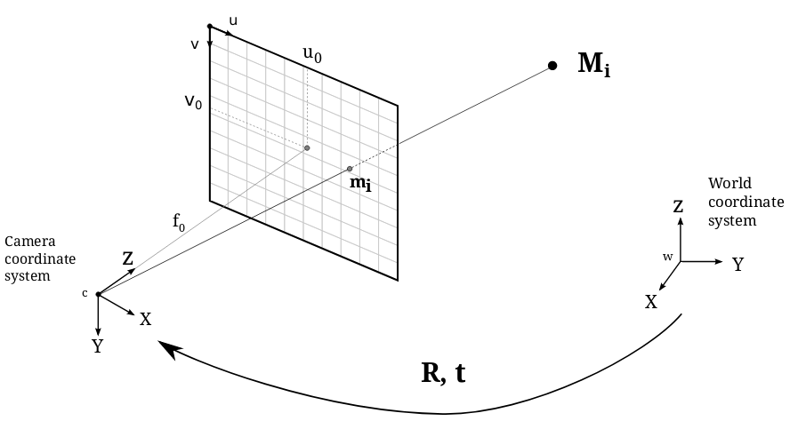

Pinhole Camera
--------------

.. currentmodule:: torchgeometry

In this module we have all the functions and data structures used to describe the projection of a 3D scene space onto a 2D image plane.

In computer vision, we can map between the 3D world and a 2D image using *projective geometry*. The module refers to the simplest camera model, the **Pinhole Camera**, which is the most basic model for general projective cameras located into the finite cameras group.

The Pinhole Camera model is shown in the figure below:

In this model, a scene view is formed by projecting 3D points into the image plane using a perspective transformation.

.. math::
    s  \; m' = K [R|t] M'

or

.. math::
    s \begin{bmatrix} u \\ v \\ 1\end{bmatrix} =
    \begin{bmatrix}
    f_x & 0 & u_0 \\
    0 & f_y & v_0 \\
    0 & 0 & 1
    \end{bmatrix}
    \begin{bmatrix}
    r_{11} & r_{12} & r_{13} & t_1  \\
    r_{21} & r_{22} & r_{23} & t_2  \\
    r_{31} & r_{32} & r_{33} & t_3
    \end{bmatrix}
    \begin{bmatrix}
    X \\
    Y \\
    Z \\
    1
    \end{bmatrix}

where:
    * :math:`M'` is a 3D point in space with coordinates :math:`[X,Y,Z]^T` expressed in a Euclidean coordinate system.
    * :math:`m'` is the projection of the 3D point :math:`M'` into the *image plane* with coordinates :math:`[u,v]^T` expressed in pixel units.
    * :math:`K` is the *camera calibration matrix*, also refered as the instrinsics parameters matrix.
    * :math:`C` is the *principal point offset* with coordinates :math:`[u_0, v_0]^T` at the origin in the image plane.
    * :math:`fx, fy` are the focal lengths expressed in pixel units.

The camera rotation and translation are expressed in terms of Euclidean coordinate frame, known as the *world coordinates system*. This terms are usually expressed by the joint rotation-translation matrix :math:`[R|t]`, or also called as the extrinsics parameters matrix. It is used to describe the camera pose around a static scene and translates the coordinates of a 3D point :math:`(X,Y,Z)` to a coordinate sytstem respect to the camera.

.. autoclass:: PinholeCamera
    :members:
.. autoclass:: PinholeCamerasList

.. note::
    The pinhole model is represented in a single vector as follows:

    .. math::
        pinhole = (f_x, f_y, c_x, c_y, height, width, r_x, r_y, r_z, t_x, t_y, t_z)
 
    where:
        :math:`(r_x, r_y, r_z)` is the rotation vector in angle-axis convention.

        :math:`(t_x, t_y, t_z)` is the translation vector.

.. autofunction:: pinhole_matrix
.. autofunction:: inverse_pinhole_matrix
.. autofunction:: scale_pinhole
.. autofunction:: homography_i_H_ref
.. autofunction:: cam2pixel
.. autofunction:: pixel2cam

.. autoclass:: PinholeMatrix
.. autoclass:: InversePinholeMatrix
